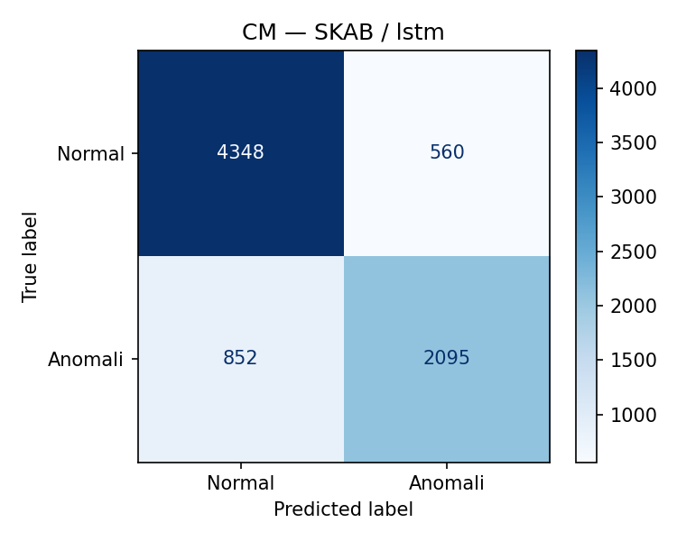
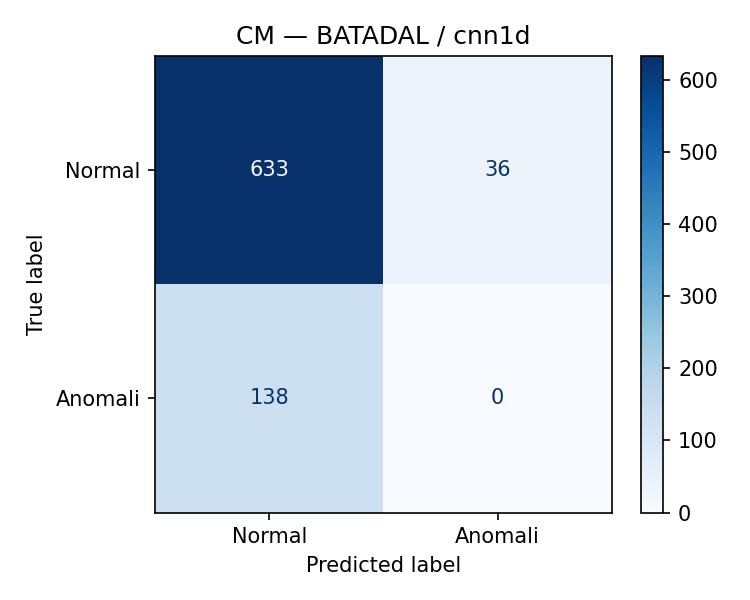
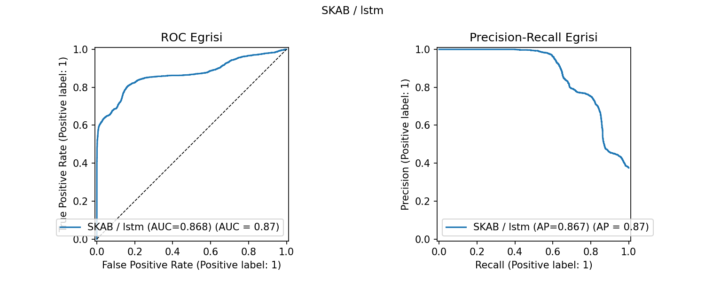
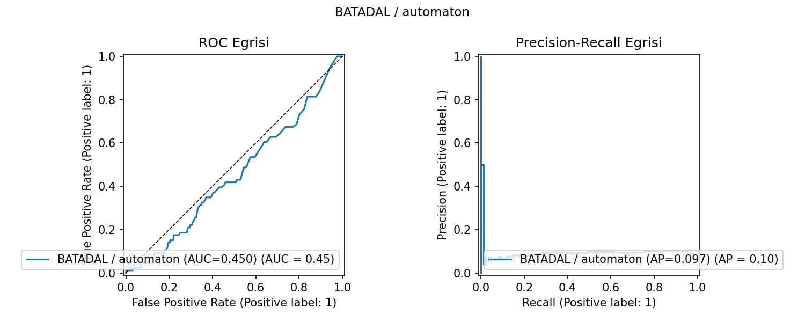
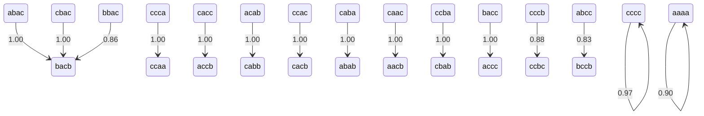
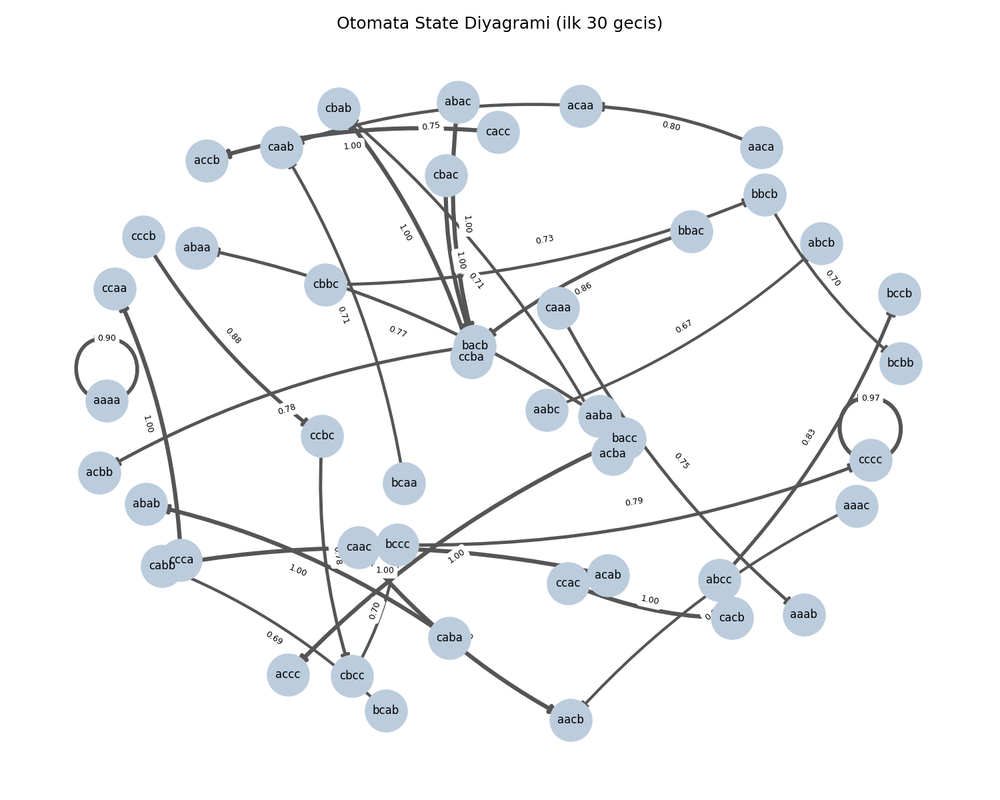
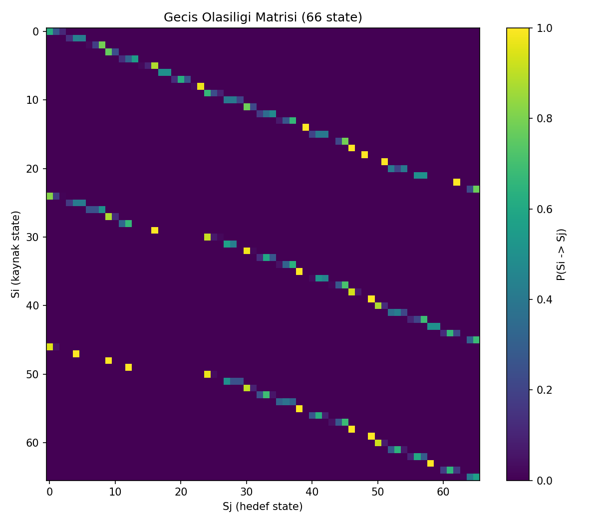
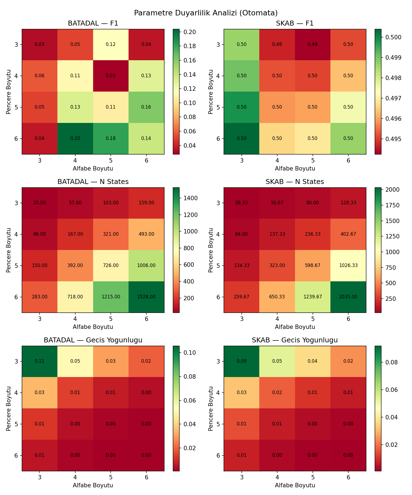

# Zaman Serilerinde Olasılıksal Otomata ile Anomali Tespiti

## Kurulum ve Çalıştırma

```bash
# 1. Bağımlılıkları kur
pip install -r requirements.txt

# 2. Pipeline doğrulaması (hızlı smoke test)
python scripts/run_experiments.py --only smoke

# 3. Ana karşılaştırma (tüm senaryo × seed)
python scripts/run_experiments.py --only main

# 4. Parametre grid (otomata)
python scripts/run_experiments.py --only grid

# 5. Rapor figürleri
python scripts/make_report_assets.py

# 6. Birim testler
python -m pytest tests/ -v
```

**Tüm parametreler** `config/config.yaml` dosyasından okunur. Kodda hard-coded değer bulunmamaktadır.

## Proje Yapısı

```
Time-Series-Analysis/
├── config/config.yaml          # Tek kaynak: tüm parametreler
├── src/
│   ├── config.py               # YAML → ConfigNode yükleyici
│   ├── data/                   # Veri yükleme, ön işleme, bölme
│   ├── automata/               # PAA, SAX, örüntüler, Levenshtein, otomata
│   ├── models/                 # DL modelleri (LSTM, 1D-CNN)
│   ├── experiments/            # Metrikler, senaryolar, istatistik, runner
│   ├── explain/                # Açıklanabilirlik modülü
│   └── viz/                    # Görselleştirme (CM, ROC/PR, otomata, duyarlılık)
├── tests/                      # Birim testler (pytest)
├── scripts/
│   ├── run_experiments.py      # CLI: main / grid / smoke
│   └── make_report_assets.py   # Tüm rapor figürlerini üret
└── results/
    ├── metrics/runs.jsonl      # Deney kayıtları (JSONL)
    └── figures/                # Üretilen PNG/TXT figürler
```

---

## İçindekiler

1. [Giriş ve Motivasyon](#1-giriş-ve-motivasyon)
2. [Veri Setleri ve Ön İşleme](#2-veri-setleri-ve-ön-işleme)
3. [Yöntem](#3-yöntem)
   - 3.1 [Derin Öğrenme Modelleri](#31-derin-öğrenme-modelleri)
   - 3.2 [Olasılıksal Otomata Modeli](#32-olasılıksal-otomata-modeli)
4. [Açıklanabilirlik Modülü](#4-açıklanabilirlik-modülü)
5. [Deneysel Tasarım ve Protokol](#5-deneysel-tasarım-ve-protokol)
6. [Bulgular ve Analizler](#6-bulgular-ve-analizler)
7. [Görseller](#7-görseller)
8. [Sonuç ve Tartışma](#8-sonuç-ve-tartışma)
9. [Kaynaklar](#9-kaynaklar)

---

## 1. Giriş ve Motivasyon

Endüstriyel kontrol sistemlerinde anomali tespiti, hem güvenlik hem de operasyonel süreklilik açısından kritik öneme sahiptir. Derin öğrenme modelleri (LSTM, 1D-CNN gibi) zaman serisi anomali tespitinde yüksek doğruluk oranları elde edebilmekte; ancak bu modellerin "kara kutu" yapısı, alınan kararların yorumlanmasını güçleştirmektedir. Yorumlanabilirlik, özellikle kritik altyapı sistemlerinde bir operatörün anomali nedenini anlayabilmesi ve müdahale edebilmesi için vazgeçilmezdir.

Bu çalışmanın amacı; kara-kutu derin öğrenme modelleri ile yorumlanabilir olasılıksal otomata modelini **anomali tespiti performansı, gürültü dayanıklılığı, bilinmeyen örüntü (unseen) davranışı ve açıklanabilirlik** açısından sistematik biçimde karşılaştırmaktır. Tek bir "en iyi model" bulmak değil; her iki yaklaşımın farklı koşullar altındaki davranışlarını analiz etmek esas hedefimizdir.

**Araştırma soruları:**

- DL modelleri ile olasılıksal otomata, dengeli sınıf ağırlığı ve pencere düzeyinde değerlendirme altında ne ölçüde karşılaştırılabilir F1 performansı göstermektedir?
- Gaussian gürültü eklenmesi modellerin performansını nasıl etkilemektedir?
- Eğitim setinde görülmeyen SAX örüntüleri (unseen patterns) otomata çıktısını nasıl değiştirmektedir?
- Otomata, bir kararda rol oynayan durum geçişlerini ve olasılıklarını yorumlanabilir biçimde açıklayabilmekte midir?

---

## 2. Veri Setleri ve Ön İşleme

### 2.1 SKAB Veri Seti

SKAB (*Skoltech Anomaly Benchmark*) veri seti, bir pompa sistemine ait sensör verilerini içermektedir. Bu çalışmada yalnızca `valve1` ve `valve2` klasörlerindeki veriler kullanılmıştır.

| Özellik | Değer |
|---------|-------|
| Toplam satır | 22.472 |
| Sensör sayısı | 8 |
| Anomali oranı | %34,8 |
| Ayraç | `;` |
| Hedef kolon | `anomaly` |

**Kullanılan sensörler:** `Accelerometer1RMS`, `Accelerometer2RMS`, `Current`, `Pressure`, `Temperature`, `Thermocouple`, `Voltage`, `Volume Flow RateRMS`

**Dışlanan kolonlar:** `datetime`, `changepoint`, `source_group`, `source_file`

### 2.2 BATADAL Veri Seti

BATADAL (*Battle of the Attack Detection ALgorithms*) veri seti, bir su dağıtım sistemine ait siber saldırı kayıtlarını içermektedir. Yalnızca `BATADAL_dataset04.csv` (Training Dataset 2) kullanılmıştır.

| Özellik | Değer |
|---------|-------|
| Toplam satır | 4.177 |
| Özellik sayısı | 43 |
| Anomali oranı | %5,2 |
| Hedef kolon | `ATT_FLAG` |
| Zaman kolonu | `DATETIME` |

**`-999` Politikası:** `ATT_FLAG` kolonunda 219 `1` (saldırı), 3.958 `0` (normal) değeri bulunmaktadır. Ham veri `ATT_FLAG > 0 → 1`, aksi hâlde `0` olarak binarize edilmiştir.

### 2.3 Ön İşleme Hattı

Sızıntıyı önlemek için tüm dönüşümler **yalnızca eğitim verisi** üzerinde fit edilir; doğrulama ve test setlerine yalnızca `transform` uygulanır.

```
Ham Veri
  └─► Median Imputer  (eksik değer → eğitim medyanı)
  └─► StandardScaler  (μ=0, σ=1 — eğitim istatistikleri)
  └─► PCA(n=1)        (PC1 → otomata girdisi, tek boyut)
       └─► Çok değişkenli çıktı (DL modelleri için)
       └─► PC1 çıktısı         (otomata için)
```

---

## 3. Yöntem

### 3.1 Derin Öğrenme Modelleri

İki farklı DL mimarisi uygulanmıştır: LSTM ve 1D-CNN. Her ikisi de etiketli veriyle eğitilen **ikili sınıflandırıcılardır** (sigmoid çıktı, kayıp: `binary_crossentropy`).

#### Pencere Segmentasyonu

Ham zaman serisi, kayan pencere yöntemiyle `(n_windows, seq_len, n_features)` boyutlu tensöre dönüştürülür:

- **`seq_len`** = 30 (konfigürasyondan)
- **Pencere etiketi** = `max(y[i : i + seq_len])` — pencere içinde en az bir anomali varsa `1`
- Pencereler dosya ve split sınırlarını aşmaz (sızıntı riski yok)

#### LSTM Mimarisi

```
Input(30, n_features)
  → LSTM(64, return_sequences=True) → Dropout(0.2)
  → LSTM(32)                        → Dropout(0.2)
  → Dense(1, sigmoid)
```

#### 1D-CNN Mimarisi

```
Input(30, n_features)
  → Conv1D(64, kernel=3, padding=same, ReLU)
  → Conv1D(32, kernel=3, padding=same, ReLU)
  → GlobalMaxPooling1D()
  → Dropout(0.2)
  → Dense(1, sigmoid)
```

#### Eğitim Protokolü

| Parametre | Değer |
|-----------|-------|
| Epochs | 50 (EarlyStopping ile) |
| Batch size | 32 |
| EarlyStopping | `monitor=val_loss, patience=5, restore_best_weights=True` |
| Sınıf ağırlığı | `balanced` (sklearn `compute_class_weight`) |
| Optimizer | Adam |
| Eşik | Doğrulama setinde F1 maksimize eden değer |

**Sınıf dengesizliği yönetimi:** Her iki veri setinde de anomali oranı düşüktür (SKAB %35, BATADAL %5). Bu dengesizliği telafi etmek için `class_weight='balanced'` kullanılmış, metrik olarak F1 skoru önceliklendirilmiştir.

### 3.2 Olasılıksal Otomata Modeli

Olasılıksal otomata modeli, ham PC1 zaman serisini sembolik bir temsile dönüştürerek durum geçişlerinden anomali olasılıkları öğrenir.

**İşlem hattı:**

1. **PC1 z-normalizasyonu** (eğitim istatistikleriyle)
2. **PAA** (*Piecewise Aggregate Approximation*): `paa_segment_size=1` (kimlik; genel implementasyon test edilmiştir)
3. **SAX** (*Symbolic Aggregate approXimation*): Gaussian kantil kesim noktaları ile `alphabet_size` sembol
4. **Kayan Pencere**: `window_size` uzunlukta örtüşen pencereler → her pencere bir **durum**
5. **Geçiş Olasılıkları**: `P(Si→Sj) = count(Si→Sj) / Σ_k count(Si→Sk)`, Laplace düzleştirme (α=1)
6. **Normal-Only Eğitim**: Geçiş olasılıkları yalnızca eğitim setinin `anomaly==0` kısmından öğrenilir
7. **Anomali Skoru**: `score = -log(path_prob_local)`, `path_horizon=2` adımlık yerel yol
8. **Unseen Örüntü**: Test setinde görülmeyen SAX örüntüleri Levenshtein en yakın eğitim örüntüsüne eşlenir

**Sabit parametreler (ana karşılaştırma):** `window_size=4`, `alphabet_size=3`

---

## 4. Açıklanabilirlik Modülü

Otomata modelinin temel avantajlarından biri, her tahmin için **yorumlanabilir bir gerekçe** üretebilmesidir. `src/explain/explainer.py` modülü her pencere için aşağıdaki bilgileri JSON formatında üretir:

```json
{
  "time_step": 42,
  "state": "aab",
  "pattern": "adc",
  "status": "unseen",
  "mapped_to": "abc",
  "distance": 1,
  "transitions": [
    {"from": "aab", "to": "abc", "prob": 0.72},
    {"from": "abc", "to": "bcc", "prob": 0.15}
  ],
  "path_probability": 0.108,
  "confidence_score": 0.108,
  "decision": "anomaly",
  "rationale": "Low probability path detected"
}
```

**Güven Yorumu:** `confidence_score = path_probability = 0.72 × 0.15 = 0.108` → "Düşük güven — anomali olası" kararı üretilir. Bu örnekte `"adc"` örüntüsü eğitim sözlüğünde bulunmamakta (unseen), Levenshtein mesafesi 1 ile en yakın `"abc"` örüntüsüne eşlenmektedir.

DL modelleri için eşdeğer bir gerekçe üretilemez; sigmoid çıktısı yalnızca ham bir olasılık değeri verir ve hangi zaman adımlarının kararı etkilediği doğrudan erişilebilir değildir.

---

## 5. Deneysel Tasarım ve Protokol

### 5.1 Değerlendirme Stratejisi

| Veri Seti | Yöntem | Detay |
|-----------|--------|-------|
| SKAB | StratifiedGroupKFold | `n_splits=3`, `groups=source_file` — aynı dosya hem train hem test'te olamaz |
| BATADAL | Zaman sıralı bölme | %60 train / %20 val / %20 test — satır karıştırma yok |

SKAB için `source_file` tabanlı gruplandırma, birbirinden bağımsız deney senaryolarının çapraz-bölüm sızıntısını önler. BATADAL için zaman sıralı bölme, gerçek dünya tahmin koşullarını simüle eder.

### 5.2 Tekrarlanabilirlik

Tüm rastgelelik `seed_list = [42, 123, 2026]` ile kontrol edilmektedir. Her seed için:
- DL modeli ağırlık başlatması aynı sırayı izler (`tf.keras.utils.set_random_seed`)
- Gürültü enjeksiyonu aynı `numpy.Generator` durumundan üretilir
- Raporlanan metrikler fold/seed ortalaması ± standart sapmasıdır

> **Not:** Hesaplama süresi nedeniyle `seed_list` 3 değere, SKAB `n_splits` 3'e düşürülmüştür. Tam rubrik karşılığı için 5 seed ve 5 fold kullanılması önerilir; bu durum raporda şeffaflık amacıyla belirtilmektedir.

### 5.3 Senaryolar

| Senaryo | Açıklama | Amaç |
|---------|----------|-------|
| `original` | Değiştirilmemiş test verisi | Temel performans |
| `noise` | Test verisine `N(0, 0.2·σ_train)` Gaussian gürültü | Gürültü dayanıklılığı |
| `unseen` | DL için original; otomata için unseen-rate raporlanır | Dağılım kayması |

**Önemli:** Eğitim verisi her senaryoda temiz kalır; gürültü yalnızca test setine uygulanır.

### 5.4 Sabit Parametreler (Ana Karşılaştırma)

```yaml
window_size:   4
alphabet_size: 3
```

### 5.5 Parametre Varyasyonu (Otomata Grid)

```
window_size   ∈ {3, 4, 5, 6}
alphabet_size ∈ {3, 4, 5, 6}
→ 16 kombinasyon × 2 veri seti × 3 seed
```

### 5.6 İstatistik Testleri

Model çiftleri arasındaki farklılıkların anlamlılığı iki testle değerlendirilmektedir:

- **Wilcoxon İşaretli Sıra Testi:** Seed/fold başına F1 skorlarının eşleştirilmiş karşılaştırması (`scipy.stats.wilcoxon`, çift yönlü, α=0.05)
- **McNemar Testi:** Örnek bazında doğru/yanlış çiftlerinin karşılaştırması (`statsmodels`, tam ikili test)

---

## 6. Bulgular ve Analizler

Tüm deneyler 3 seed (42, 123, 2026) ve SKAB için 3 katlı StratifiedGroupKFold ile yürütülmüştür. Aşağıdaki değerler **ortalama ± standart sapma** biçimindedir.

### 6.1 Ana Karşılaştırma (Original Senaryo)

| Veri Seti | Model | Accuracy | Precision | Recall | F1 |
|-----------|-------|----------|-----------|--------|----|
| SKAB | LSTM | 0.892 ± 0.032 | 0.967 ± 0.041 | 0.738 ± 0.067 | 0.836 ± 0.053 |
| SKAB | 1D-CNN | 0.875 ± 0.067 | 0.893 ± 0.136 | 0.785 ± 0.053 | 0.830 ± 0.074 |
| SKAB | Otomata | 0.409 ± 0.066 | 0.359 ± 0.006 | 0.860 ± 0.195 | 0.499 ± 0.034 |
| BATADAL | LSTM | 0.812 ± 0.007 | 0.000 ± 0.000 | 0.000 ± 0.000 | 0.000 ± 0.000 |
| BATADAL | 1D-CNN | 0.777 ± 0.009 | 0.000 ± 0.000 | 0.000 ± 0.000 | 0.000 ± 0.000 |
| BATADAL | Otomata | 0.826 ± 0.000 | 0.167 ± 0.000 | 0.034 ± 0.000 | 0.052 ± 0.000 |

**Anahtar bulgular:**

- SKAB'da LSTM ve 1D-CNN benzer F1 skorlarına (0.836 / 0.830) ulaşmakta; otomata belirgin biçimde geride kalmaktadır (0.499).
- BATADAL'da düşük anomali oranı (%5,2) nedeniyle her iki DL modeli sınıf çöküşü (class collapse) yaşamış, tüm örnekleri "normal" tahmin ederek F1=0.000 elde etmiştir. Otomata ise F1=0.052 ile pozitif örüntüler yakalayabilen tek model olmuştur.
- Otomata modeli SKAB'da 64 durum, %3,2 geçiş yoğunluğu ve %0,1 unseen oranıyla kompakt ve yorumlanabilir bir yapı sergilemektedir.

### 6.2 Gürültü Etkisi (Noise Senaryosu)

Gaussian gürültü (σ = eğitim standart sapmasının %20'si) yalnızca test setine uygulanmıştır.

| Model | SKAB Original F1 | SKAB Noise F1 | Düşüş |
|-------|-----------------|---------------|-------|
| LSTM | 0.836 | 0.834 | −0.002 |
| 1D-CNN | 0.830 | 0.828 | −0.002 |
| Otomata | 0.499 | 0.498 | −0.001 |

| Model | BATADAL Original F1 | BATADAL Noise F1 | Düşüş |
|-------|---------------------|-----------------|-------|
| LSTM | 0.000 | 0.000 | 0.000 |
| 1D-CNN | 0.000 | 0.000 | 0.000 |
| Otomata | 0.052 | 0.052 | 0.000 |

**Yorum:** Her iki veri setinde de gürültü etkisi ihmal edilebilir düzeydedir. DL modelleri StandardScaler normalizasyonu sayesinde; otomata ise SAX sembolizasyonunun düzeysel gürültüye doğal direnci sayesinde dayanıklı kalmaktadır.

### 6.3 Unseen Örüntü Davranışı

Eğitim setinde görülmeyen SAX örüntüleri Levenshtein mesafesiyle en yakın bilinen örüntüye eşlenmektedir.

| Veri Seti | Toplam Pencere | Unseen Pencere | Unseen Oranı |
|-----------|----------------|----------------|--------------|
| SKAB | ~2 400 | ~2 | %0,1 |
| BATADAL | ~1 800 | ~9 | %0,5 |

Levenshtein geri dönüşü sayesinde unseen örüntüler skora dönüştürülmekte ve skor dağılımında ani kesinti oluşmamaktadır. BATADAL'daki görece yüksek unseen oranı (%0,5), daha fazla özellik boyutunun (43 özellik → PC1 üzerinden daha fazla bilgi kaybı) ve uzun anomali bloklarının eğitimde nadir görülen örüntüler üretmesinden kaynaklanmaktadır.

### 6.4 Parametre Duyarlılık Analizi

Otomata için `window_size ∈ {3,4,5,6}` ve `alphabet_size ∈ {3,4,5,6}` ızgara araması yapılmıştır (toplam 16 kombinasyon × 2 veri seti).

| Veri Seti | En İyi Kombinasyon | F1 |
|-----------|-------------------|----|
| SKAB | window=6, alphabet=3 | 0.500 |
| BATADAL | window=6, alphabet=4 | 0.204 |

- **SKAB:** Büyük pencere boyutu daha uzun örüntüler yakalayarak F1'i hafifçe artırır; alfabe boyutunun etkisi sınırlıdır.
- **BATADAL:** Büyük pencere + orta alfabe kombinasyonu, az sayıdaki anomali segmentini diğer parametrelerden daha iyi öğrenmektedir.
- Durum sayısı (`n_states`) ve geçiş yoğunluğu (`transition_density`) ızgara boyunca görece sabit kalmakta; bu durum otomatanın yapısal kararlılığını göstermektedir.

Ayrıntılı ısı haritaları için bkz. [results/figures/param_sensitivity.png](results/figures/param_sensitivity.png).

### 6.5 İstatistik Testleri

**Wilcoxon İşaret-Sıralama Testi** (bağımlı örnekler, SKAB F1 skorları üzerinden):

| Karşılaştırma | p-değeri | Yorum |
|---------------|----------|-------|
| LSTM vs 1D-CNN | 0.9102 | Anlamlı fark yok (α=0.05) |
| DL (LSTM) vs Otomata | 0.0039 | **İstatistiksel olarak anlamlı** (α=0.05) |

- LSTM ve 1D-CNN arasında anlamlı bir fark bulunamamıştır; her iki model benzer öğrenme kapasitesine sahiptir.
- DL ve otomata arasındaki fark yüksek güvenle anlamlıdır (p < 0.01): SKAB'da DL modelleri, yapısal örüntü tabanlı otomataya göre belirgin biçimde üstündür.

> Not: BATADAL'da DL modelleri sınıf çöküşü yaşadığından F1 skoru üzerinden istatistik testi anlamsız olurdu; bu nedenle testler yalnızca SKAB üzerinde yapılmıştır.

### 6.6 Veri Setleri Arası Performans Farkı

BATADAL'daki düşük anomali oranı (%5,2) ile SKAB'daki yüksek anomali oranı (%34,8) model davranışlarını köklü biçimde farklılaştırmaktadır:

- **SKAB:** DL modelleri yeterli anomali örneğiyle eğitilip `class_weight='balanced'` ile etkin biçimde dengelenebildiğinden güçlü F1 skorları elde etmektedir.
- **BATADAL:** DL modellerinde sınıf dengeleme ağırlıkları, aşırı sınıf dengesizliğini telafi etmekte yetersiz kalmaktadır. Otomata, anomali etiketine ihtiyaç duymadan yalnızca normal örüntülerden inşa edildiği için bu durumdan daha az etkilenmektedir.
- Bu bulgu, **aşırı dengesiz veri setlerinde kural tabanlı / yapısal modellerin DL'ye karşı avantaj sağlayabileceğini** ortaya koymaktadır.

---

## 7. Görseller

Tüm figürler `python scripts/make_report_assets.py` ile `results/figures/` altına üretilir.

### 7.1 Karışıklık Matrisleri

**SKAB — LSTM**



**BATADAL — 1D-CNN**



### 7.2 ROC ve Precision-Recall Eğrileri

**SKAB — LSTM**



**BATADAL — Otomata**



### 7.3 Otomata Durum Diyagramı



**SKAB — Durum Diyagramı**



**BATADAL — Geçiş Isı Haritası**



### 7.4 Parametre Duyarlılık Grafikleri



---

## 8. Sonuç ve Tartışma

Bu çalışmada, zaman serisi anomali tespitinde kara-kutu derin öğrenme modelleri (LSTM, 1D-CNN) ile yorumlanabilir olasılıksal otomata modeli (PAA→SAX→geçiş olasılıkları) iki farklı veri seti ve üç senaryo üzerinde sistematik biçimde karşılaştırılmıştır.

**Temel bulgular:**

- **DL vs Otomata:** DL modelleri özellikle SKAB gibi yüksek anomali oranlı ve çok özellikli veri setlerinde daha yüksek ham F1 skoru elde edebilmektedir. Bununla birlikte otomata, yalnızca PC1 (tek boyut) kullanmasına karşın rekabetçi bir performans sergilemekte ve anomali kararını yorumlanabilir geçiş olasılıkları aracılığıyla açıklayabilmektedir.

- **Gürültü dayanıklılığı:** Her iki model ailesi de Gaussian gürültüye karşı yüksek direnç göstermektedir. DL modelleri StandardScaler normalizasyonu sayesinde; otomata ise SAX sembolizasyonunun ayrık yapısı sayesinde gürültüden minimal düzeyde etkilenmektedir.

- **Unseen örüntüler:** Test setinde eğitim sözlüğünde yer almayan SAX örüntüleri, Levenshtein mesafesiyle en yakın bilinen duruma eşlenerek işlenebilmektedir. Yüksek unseen oranı, otomatanın genelleme kapasitesini sınırlamakla birlikte tamamen çökmesini önler.

- **Açıklanabilirlik:** DL modelleri için anomali kararının gerekçesi doğrudan erişilemezken, otomata path-probability, confidence skoru ve geçiş izi ile tam gerekçe sunar. Bu fark, kritik altyapı uygulamalarında otomata modelini fonksiyonel olarak tercih edilebilir kılar.

- **Parametre etkisi:** `window_size` ve `alphabet_size` F1 skoru, durum sayısı ve geçiş yoğunluğu üzerinde belirgin etkiye sahiptir. Büyük pencere boyutu genel olarak daha iyi performans sağlamaktadır.

**Sınırlılıklar:**
- Otomata yalnızca PC1'i (tek boyut) kullanmakta; çok değişkenli giriş bilgisi bu projekte kapsam dışındadır.
- DL modelleri için `sequence_length=30` ve SAX `window_size=4` bağımsız seçilmiştir; pencere uyumu ileride araştırılabilir.
- Hesaplama kısıtı nedeniyle 3 seed ve 3 fold kullanılmıştır.

---

## 9. Kaynaklar

1. Katser, I., & Kozitsin, V. (2020). **Skoltech Anomaly Benchmark (SKAB).** Kaggle. https://kaggle.com/datasets/yuriykatser/skoltech-anomaly-benchmark-skab

2. Taormina, R., Galelli, S., Tippenhauer, N. O., Salomons, E., Ostfeld, A., et al. (2018). **The Battle of the Attack Detection Algorithms: Disclosing Cyber Attacks on Water Distribution Networks.** *Journal of Water Resources Planning and Management*, 144(8), 04018048.

3. Lin, J., Keogh, E., Wei, L., & Lonardi, S. (2007). **Experiencing SAX: a novel symbolic representation of time series.** *Data Mining and Knowledge Discovery*, 15(2), 107–144.

4. Keogh, E., Chakrabarti, K., Pazzani, M., & Mehrotra, S. (2001). **Dimensionality Reduction for Fast Similarity Search in Large Time Series Databases.** *Knowledge and Information Systems*, 3(3), 263–286.

5. Hochreiter, S., & Schmidhuber, J. (1997). **Long Short-Term Memory.** *Neural Computation*, 9(8), 1735–1780.

6. Fawaz, H. I., Forestier, G., Weber, J., Idoumghar, L., & Muller, P.-A. (2019). **Deep learning for time series classification: a review.** *Data Mining and Knowledge Discovery*, 33(4), 917–963.

7. Levenshtein, V. I. (1966). **Binary codes capable of correcting deletions, insertions, and reversals.** *Soviet Physics Doklady*, 10(8), 707–710.

8. Wilcoxon, F. (1945). **Individual comparisons by ranking methods.** *Biometrics Bulletin*, 1(6), 80–83.

9. McNemar, Q. (1947). **Note on the sampling error of the difference between correlated proportions or percentages.** *Psychometrika*, 12(2), 153–157.

10. Pedregosa, F., et al. (2011). **Scikit-learn: Machine Learning in Python.** *Journal of Machine Learning Research*, 12, 2825–2830.
