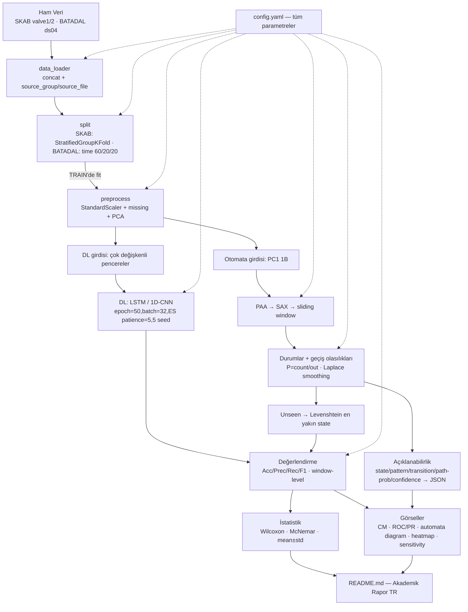
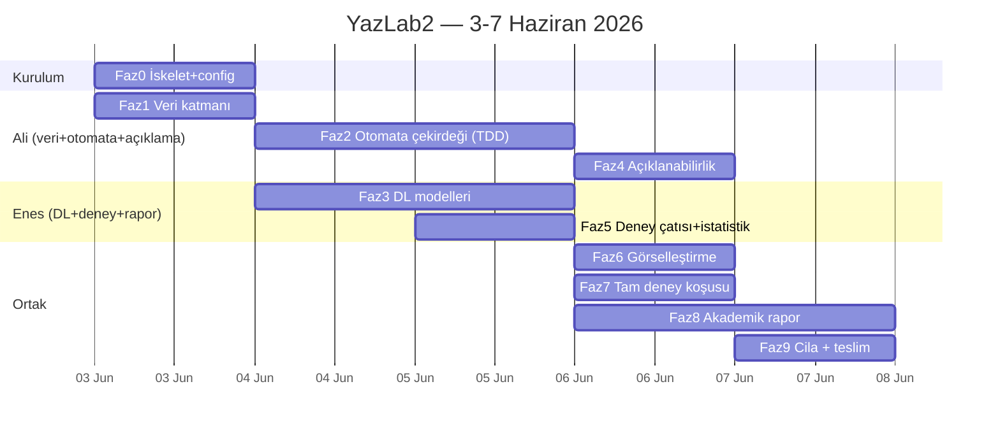

# YazLab2 — Probabilistic Automata for Time Series Analysis · Uygulama Planı

> **Ajan/uygulayıcı için:** Bu planı Claude (ben) uygulayacak; Ali ve Enes modül sahipliği + kod incelemesi + commit yapacak. Adımlar checkbox (`- [ ]`) ile takip edilir. Çekirdek algoritmik modüller **TDD** ile (önce test, sonra kod) yazılır. Sık ve dengeli commit zorunlu (rubrik kuralı).

**Goal:** SKAB ve BATADAL zaman serileri üzerinde, yorumlanamayan derin öğrenme modelleri (LSTM, 1D-CNN) ile yorumlanabilir olasılıksal otomata modelini (PAA→SAX→sliding-window→durum geçiş olasılıkları) anomali tespiti çerçevesinde karşılaştıran, açıklanabilirlik modülü içeren, tamamen parametrik ve yeniden üretilebilir bir araştırma yazılımı kurmak.

**Architecture:** Merkezi `config.yaml` → pipeline'lar (veri → ön işleme → split → {DL, otomata} → değerlendirme → açıklama → görsel/rapor). Hard-coded değer yok; tüm parametreler config'ten gelir. Sızıntı önleme: scaler/PCA/SAX-sözlüğü/geçiş-olasılıkları **yalnızca train** üzerinde fit edilir.

**Tech Stack:** Python 3.11 · pandas/numpy · scikit-learn (StandardScaler, PCA, GroupKFold/StratifiedGroupKFold) · TensorFlow/Keras (LSTM, 1D-CNN) · scipy + statsmodels (Wilcoxon, McNemar) · matplotlib/seaborn/networkx (görseller) · PyYAML (config) · pytest (birim testler).

---

## İçindekiler
1. [Bağlam (neden / mevcut durum / son tarih)](#1-bağlam)
2. [Kararlar Özeti](#2-kararlar-özeti)
3. [Mimari ve Veri Akışı](#3-mimari-ve-veri-akışı)
4. [Repo Dosya Yapısı](#4-repo-dosya-yapısı)
5. [Merkezi Konfigürasyon (`config.yaml`)](#5-merkezi-konfigürasyon)
6. [Görev Dağılımı ve Commit Dengesi](#6-görev-dağılımı-ve-commit-dengesi)
7. [Takvim (3–7 Haziran 2026)](#7-takvim)
8. [Modelleme Kararları (önemli)](#8-modelleme-kararları)
9. [Fazlar (0–9) — detaylı görevler](#9-fazlar)
10. [Test Stratejisi](#10-test-stratejisi)
11. [Doğrulama / Definition of Done (rubrik eşlemesi)](#11-doğrulama--definition-of-done)
12. [Riskler ve Azaltma](#12-riskler-ve-azaltma)

---

## 1. Bağlam

**Neden:** YazLab2 dersi 2. proje. Amaç tek "en iyi model" bulmak değil; black-box (DL) ve yorumlanabilir (otomata) yaklaşımların **performans, gürültü dayanıklılığı, unseen veri davranışı ve açıklanabilirlik** açısından bilimsel/sistematik karşılaştırılması.

**Mevcut durum:** Repo'da veri setleri hazır (`SKAB/`, `BATADAL/`) ve başlangıç `src/data_loader.py` var. Ancak loader şartnameye uymuyor:
- SKAB için `valve1`+`valve2` dışında `other` ve `anomaly-free`'yi de yüklüyor; kolon adı `scenario` (şartname `source_group` istiyor). → Revize edilecek.
- BATADAL loader `*.csv`'lerin hepsini birleştiriyor; biz **yalnızca `BATADAL_dataset04.csv` (Training Dataset 2)** kullanacağız.

**Doğrulanmış veri gerçekleri:**
- SKAB CSV ayraç `;`. Sensör kolonları (8): `Accelerometer1RMS, Accelerometer2RMS, Current, Pressure, Temperature, Thermocouple, Voltage, Volume Flow RateRMS`. Hedef: `anomaly`. Girdiye **dahil edilmeyecek**: `datetime, changepoint, source_group, source_file`.
- BATADAL `dataset04.csv` ayraç `,` (başlıkta `, ` boşluklu → `skipinitialspace=True`). Hedef kolonu **`ATT_FLAG`** (README ile doğrulandı). Zaman kolonu `DATETIME` (model girdisine alınmaz). `ATT_FLAG` içinde `-999` (etiketsiz/gizlenmiş dönem) değerleri var → ön işlemede ele alınacak (bkz. §8).

**Son tarih:** Teslim **7 Haziran 2026 Pazar 23:59**. Bugün 3 Haziran → **~4 gün**. Plan buna göre sıkı ama mandatory rubrik kalemlerini önceliklendirir.

## 2. Kararlar Özeti

| Karar | Seçim | Gerekçe |
|---|---|---|
| DL framework | **TensorFlow/Keras** | `model.fit` + `EarlyStopping(patience=5, monitor=val_loss)` ile sabit eğitim parametreleri az kodla karşılanır |
| DL modelleri | **LSTM + 1D-CNN** | Mimari olarak en farklı iki model; şartnamenin "en az 2" şartını karşılar |
| Görev dağılımı | **Bileşene göre** | Ali: veri+otomata+açıklanabilirlik · Enes: DL+deney+istatistik+rapor |
| Rapor dili | **Türkçe** | Ders/şartname Türkçe; kod & identifier'lar İngilizce |
| Problem tipi | **Supervised binary anomali tespiti** | Etiketler (`anomaly`/`ATT_FLAG`) var; metrikler Accuracy/Precision/Recall/F1 |
| Otomata inşa verisi | **Normal-only (train'in anomaly=0 kısmı)** | "Düşük olasılık → anomali" semantiğiyle uyumlu (bkz. §8) |
| Değerlendirme granülaritesi | **Window-level** (her iki model ailesi aynı pencerelerde) | DL ↔ otomata adil karşılaştırma |
| Deney takibi | **Hafif yerel JSON/CSV loglama** | Altyapı gerektirmez, yeniden üretilebilir, "karşılaştırılabilir format" şartını karşılar |

## 3. Mimari ve Veri Akışı



Üç senaryo (`original`, `noise`=Gaussian, `unseen`) ve iki aşamalı parametre deneyi (sabit: window=4/alphabet=3; varyasyon: window∈{3,4,5,6}×alphabet∈{3,4,5,6}) bu akış üzerinden config ile sürülür.

## 4. Repo Dosya Yapısı

> **Sahiplik etiketleri:** 🅰️=Ali, 🅴=Enes, 🅰️🅴=ortak/paired. Kodu Claude yazar; sahibi inceler, lokal test eder, kendi git kimliğiyle commit eder.

```
Time-Series-Analysis/
├── config/
│   └── config.yaml              # 🅰️🅴 TÜM parametreler (tek kaynak)
├── src/
│   ├── __init__.py
│   ├── config.py                # 🅰️🅴 YAML → Config (dataclass) yükle + doğrula
│   ├── data/
│   │   ├── __init__.py
│   │   ├── data_loader.py       # 🅰️ (revize) SKAB valve1/2 + BATADAL ds04
│   │   ├── preprocess.py        # 🅰️ scaler+missing+PCA (TRAIN'de fit)
│   │   └── splits.py            # 🅰️ SKAB GroupKFold · BATADAL time 60/20/20
│   ├── automata/
│   │   ├── __init__.py
│   │   ├── paa.py               # 🅰️ Piecewise Aggregate Approximation
│   │   ├── sax.py               # 🅰️ SAX (breakpoints + symbol map + sözlük)
│   │   ├── patterns.py          # 🅰️ sliding window pattern çıkarımı
│   │   ├── levenshtein.py       # 🅰️ edit distance + en yakın pattern eşleme
│   │   └── automaton.py         # 🅰️ state/geçiş/olasılık/smoothing/path-prob/predict
│   ├── models/
│   │   ├── __init__.py
│   │   └── dl_models.py         # 🅴 windowing + build_lstm + build_cnn1d + train
│   ├── explain/
│   │   ├── __init__.py
│   │   └── explainer.py         # 🅰️ karar açıklaması (JSON), confidence, counterfactual*
│   ├── experiments/
│   │   ├── __init__.py
│   │   ├── scenarios.py         # 🅴 original/noise/unseen dönüşümleri
│   │   ├── metrics.py           # 🅴 acc/prec/rec/f1 + mean/std aggregation
│   │   ├── stats_tests.py       # 🅴 Wilcoxon + McNemar
│   │   ├── logging_utils.py     # 🅴 run params+metrics → JSON/CSV
│   │   └── runner.py            # 🅴 dataset×seed×scenario×param orkestrasyonu
│   └── viz/
│       ├── __init__.py
│       └── plots.py             # 🅰️🅴 CM/ROC-PR/automata/heatmap/sensitivity
├── tests/
│   ├── test_paa.py · test_sax.py · test_patterns.py        # 🅰️
│   ├── test_levenshtein.py · test_automaton.py             # 🅰️ (Levenshtein ZORUNLU)
│   ├── test_explainer.py                                   # 🅰️
│   ├── test_splits.py · test_preprocess.py                 # 🅰️
│   ├── test_dl_models.py                                   # 🅴
│   └── test_metrics.py · test_stats.py · test_scenarios.py # 🅴
├── scripts/
│   ├── run_experiments.py       # 🅴 CLI giriş: config oku → her şeyi koş
│   └── make_report_assets.py    # 🅰️🅴 tüm figür/tabloları üret
├── results/                     # çıktı (loglar/metrikler/figürler) — .gitignore'da büyük dosyalar
│   ├── logs/ · metrics/ · figures/
├── notebooks/eda.ipynb          # 🅰️🅴 keşifsel analiz (opsiyonel)
├── requirements.txt             # 🅴 (güncellenecek)
├── README.md                    # 🅴 lead — Akademik Rapor (TR)
└── .gitignore                   # 🅰️🅴
```

## 5. Merkezi Konfigürasyon

`config/config.yaml` — tek doğruluk kaynağı; parametre değişince tüm sistem yeniden üretilir. `src/config.py` bunu `Config` dataclass'ına yükler ve doğrular (örn. oranlar toplamı 1.0, alphabet≥2).

```yaml
seed_list: [42, 123, 2026, 7, 999]

fixed_params:        # zorunlu karşılaştırma noktası
  window_size: 4
  alphabet_size: 3

param_grid:          # parametre varyasyonu (otomata)
  window_size: [3, 4, 5, 6]
  alphabet_size: [3, 4, 5, 6]

scenarios: [original, noise, unseen]
noise:
  type: gaussian
  sigma_ratio: 0.2   # her özelliğin train std'sinin oranı
  apply_to: test     # train temiz, test gürültülü (robustness)

automaton:
  paa_segment_size: 1     # PAA segment uzunluğu (1=örnek başına; >1 sıkıştırır)
  build_on: normal_only   # train'in anomaly==0 kısmı
  smoothing: laplace
  smoothing_alpha: 1.0
  score: neg_log_path     # anomali skoru = -log(path_prob)
  path_horizon: 2         # confidence için yerel path uzunluğu (örnekteki gibi)
  threshold: auto_f1      # validasyonda F1 maksimize eden eşik

dl:
  epochs: 50
  batch_size: 32
  early_stopping: {monitor: val_loss, patience: 5, restore_best_weights: true}
  sequence_length: 30     # DL lookback (SAX window'dan bağımsız)
  class_weight: balanced
  models: [lstm, cnn1d]
  lstm:  {units: [64, 32], dropout: 0.2}
  cnn1d: {filters: [64, 32], kernel_size: 3, dropout: 0.2}

datasets:
  skab:
    dir: SKAB
    use_folders: [valve1, valve2]
    sep: ";"
    target: anomaly
    drop_cols: [datetime, changepoint, source_group, source_file]
    cv: {strategy: stratified_group_kfold, n_splits: 5, group_col: source_file}
  batadal:
    file: BATADAL/BATADAL_dataset04.csv
    sep: ","
    skipinitialspace: true
    target: ATT_FLAG
    time_col: DATETIME
    unlabeled_value: -999
    unlabeled_policy: as_normal   # -999 → 0 (rapora not düşülecek; bkz §8)
    split: {train: 0.6, val: 0.2, test: 0.2}

preprocess:
  scaler: standard         # StandardScaler (TRAIN'de fit)
  impute: median           # eksik veri (TRAIN istatistiği)
  pca: {enabled: true, n_components: 1}   # PC1 (otomata için)

paths: {results: results, figures: results/figures, metrics: results/metrics, logs: results/logs}
```

## 6. Görev Dağılımı ve Commit Dengesi

**Bileşen sahipliği:**

| Ali (🅰️) | Enes (🅴) |
|---|---|
| `config.py` (ortak) | `requirements.txt` |
| `data/` (loader, preprocess, splits) | `models/dl_models.py` |
| `automata/` (paa, sax, patterns, levenshtein, automaton) | `experiments/` (scenarios, metrics, stats, logging, runner) |
| `explain/explainer.py` | `scripts/run_experiments.py` |
| İlgili tüm `tests/` (data + automata + explain) | `scripts/make_report_assets.py` (Ali ile) |
| Otomata/açıklanabilirlik rapor bölümleri | `README.md` rapor lead'i + ilgili testler |
| `viz/plots.py` automata diagram + heatmap | `viz/plots.py` CM/ROC-PR/sensitivity |

**Commit dengesi (rubrik: dengesiz commit → 0):**
- Her sahip **kendi modüllerini kendi git kimliğiyle** commit eder (Ali: `aliieroglu`; Enes kendi GitHub kimliğini repo'ya remote/collaborator olarak ekler ve kendi makinesinden/commit kimliğiyle push eder).
- Paired/ortak dosyalarda `Co-authored-by:` trailer kullanılır.
- Faz başına **birden çok küçük commit** (her TDD döngüsü = 1 commit). Conventional Commits: `feat:`, `test:`, `fix:`, `docs:`, `chore:`.
- Hedef: faz sonunda iki kişinin commit sayısı kabaca dengeli. Claude kod üretir; **commit'i sahip atar** (Claude commit yapmaz, sadece diff'i hazırlar/açıklar).

## 7. Takvim



## 8. Modelleme Kararları

Bu kararlar rapora da yazılacak (akademik şeffaflık):

1. **Problem:** Supervised binary anomali tespiti. DL = sınıflandırıcı (sigmoid). Otomata = path-probability tabanlı skor → eşik.
2. **DL girdisi çok değişkenli** (8 SKAB / ~43 BATADAL sensörü, normalize). **Otomata girdisi PC1** (PCA 1B), şartname gereği.
3. **PAA→SAX→pencere:** PC1 z-normalize → PAA (`paa_segment_size`, default 1 → kimlik; genel impl. test edilir) → SAX (Gaussian breakpoint'lerle `alphabet_size` sembol) → sembol dizisi → `window_size` uzunlukta **kayan pencere** ile pattern'lar. Her benzersiz pattern = state. Pattern uzunluğu = `window_size`.
4. **Geçiş olasılığı:** `P(Si→Sj)=count(Si→Sj)/Σ_k count(Si→Sk)`. **Laplace smoothing** (`alpha`) ile train'de görülmemiş geçişlere sıfır-olmayan olasılık. Pencereler **kaynak dosya / kesintisiz segment içinde** üretilir (dosya/split sınırını aşan geçiş yok).
5. **Otomata normal-only:** Geçiş olasılıkları train'in **`anomaly==0`** kısmından öğrenilir → anomalik diziler düşük path-prob alır ("düşük olasılık = anomali" semantiği). (config ile `all`'a çevrilebilir; rapora alternatif olarak not düşülür.)
6. **Unseen:** Train SAX sözlüğü çıkarılır; testte sözlükte olmayan pattern = unseen → **Levenshtein** ile en yakın train pattern'ına eşlenir, o state üzerinden devam.
7. **Anomali skoru & confidence:** Pencere skoru = `-log(path_prob_local)` (`path_horizon` adımlık yerel path). Eşik validasyonda F1'i maksimize edecek şekilde seçilir. **Confidence = path_probability** (şartname örneğiyle birebir: `0.72*0.15=0.108 → Low`).
8. **Değerlendirme window-level:** Hem DL hem otomata aynı pencere kümesinde değerlendirilir. Pencere gerçek etiketi = pencerede en az bir anomali varsa 1 (`max`). DL: pencere→son adım etiketi yerine `max` etiketi (tutarlılık için ikisi de `max`).
9. **Noise senaryosu:** train temiz; **test'e** özellik-başına `N(0, sigma_ratio·σ_train)` Gaussian gürültü → robustness ölçümü.
10. **BATADAL `-999`:** `ATT_FLAG` benzersiz değerleri/sayıları **inceleme adımıyla** doğrulanır. Politika: `-999 → 0 (normal)` (default), rapora `-999` satır sayısı ve gerekçe yazılır. Gerekirse `Attacks_TrainingDataset2.jpg`/BATADAL dokümanındaki saldırı aralıkları ile etiketleme alternatifi uygulanır. (`unlabeled_policy` config'te.)

## 9. Fazlar

> Her görev: **Sahip · Dosyalar · Adımlar (TDD)**. Çekirdek algoritmalar için gerçek test+kod verilmiştir; orkestrasyon görevleri için imza+davranış sözleşmesi verilmiştir (kodu Claude execution'da bu sözleşmeye göre yazar). Her görev sonunda **commit**.

---

### Faz 0 — Proje İskeleti & Ortam · 🅰️🅴

**Dosyalar:** `requirements.txt`, `config/config.yaml`, `src/config.py`, `.gitignore`, tüm `__init__.py`, `tests/` iskeleti.

- [ ] **0.1** `requirements.txt` güncelle (🅴):
```
pandas>=2.0
numpy>=1.26
scikit-learn>=1.4
tensorflow>=2.15        # Windows CPU/GPU; gerekirse tensorflow-cpu
scipy>=1.11
statsmodels>=0.14
matplotlib>=3.8
seaborn>=0.13
networkx>=3.2
pyyaml>=6.0
tqdm>=4.66
pytest>=8.0
```
- [ ] **0.2** `.gitignore` (🅰️🅴): `__pycache__/`, `.venv/`, `results/figures/*.png` (büyük çıktı), `*.h5`/`*.keras`, `.pytest_cache/`, `*.ipynb_checkpoints`. (Küçük metrik JSON/CSV'ler commit'lenebilir.)
- [ ] **0.3** `config/config.yaml` yaz (§5'teki içerik) (🅰️🅴).
- [ ] **0.4** `src/config.py` (🅰️🅴): `load_config(path="config/config.yaml") -> Config`. `Config` iç içe dataclass; doğrulamalar: `0.99 ≤ train+val+test ≤ 1.01`, `alphabet_size≥2`, `window_size≥2`, `n_components≥1`. `from_dict` ile YAML map'i dataclass'a dönüştür.
- [ ] **0.5** `pytest.ini`/`pyproject` minimal: `tests/` keşfi; `PYTHONPATH=.`.
- [ ] **0.6** Ortam: `python -m venv .venv && .venv\Scripts\Activate.ps1 && pip install -r requirements.txt`.
- [ ] **Verify:** `python -c "from src.config import load_config; print(load_config())"` hatasız Config basar.
- [ ] **Commit:** `chore: project scaffold, central config, requirements` (Ali); `chore: test setup + requirements` (Enes).

---

### Faz 1 — Veri Katmanı · 🅰️

**Dosyalar:** `src/data/data_loader.py` (revize), `src/data/splits.py`, `src/data/preprocess.py`, `tests/test_splits.py`, `tests/test_preprocess.py`.

- [ ] **1.1 SKAB loader (revize):** `load_skab(cfg) -> pd.DataFrame`. Yalnız `use_folders=[valve1,valve2]`; her dosyada `source_group=<klasör>`, `source_file=<dosya adı>` ekle; `;` ayraç; `anomaly` int'e cast; concat. (Mevcut `other`/`anomaly-free` ve `scenario` kaldırılır.)
- [ ] **1.2 BATADAL loader:** `load_batadal(cfg) -> pd.DataFrame`. Yalnız `BATADAL_dataset04.csv`; `skipinitialspace=True`; kolon adlarını `.str.strip()`; `DATETIME` parse; `ATT_FLAG` → `apply_unlabeled_policy` (-999 politikası) → int `target`. **İnceleme adımı:** `df.ATT_FLAG.value_counts()` logla (rapora -999 sayısı).
- [ ] **1.3 splits.py — SKAB:** `skab_folds(df, cfg) -> list[(train_idx, test_idx)]`. `StratifiedGroupKFold(n_splits)` (fallback `GroupKFold`), `groups=source_file`, `y=anomaly`. Garanti: aynı `source_file` hem train hem test'te olamaz.
- [ ] **1.4 splits.py — BATADAL:** `batadal_split(df, cfg) -> (train, val, test)`. Zaman sırasını koru (`sort_values(DATETIME)`), **satır bazlı** %60/%20/%20 ardışık dilim. Rastgele bölme YOK.
- [ ] **1.5 preprocess.py:** `fit_preprocess(train_X, cfg) -> Preprocessor` ve `Preprocessor.transform(X)`. İçerik: median impute → StandardScaler → (otomata yolu için) PCA `n_components`. **Hepsi train'de fit, val/test'e transform.** İki çıktı sağla: `transform_multivariate` (DL) ve `transform_pc1` (otomata).

**Kilit testler (gerçek):**
```python
# tests/test_splits.py
def test_skab_groupkfold_no_leakage(skab_sample_df, cfg):
    for tr, te in skab_folds(skab_sample_df, cfg):
        tr_files = set(skab_sample_df.iloc[tr].source_file)
        te_files = set(skab_sample_df.iloc[te].source_file)
        assert tr_files.isdisjoint(te_files)

def test_batadal_split_is_time_ordered_60_20_20(batadal_sample_df, cfg):
    tr, va, te = batadal_split(batadal_sample_df, cfg)
    n = len(batadal_sample_df)
    assert abs(len(tr)/n - 0.6) < 0.01 and abs(len(va)/n - 0.2) < 0.01
    assert tr.DATETIME.max() <= va.DATETIME.min() <= te.DATETIME.min()

# tests/test_preprocess.py
def test_scaler_and_pca_fit_on_train_only(train_X, test_X, cfg):
    pre = fit_preprocess(train_X, cfg)
    z = pre.transform_multivariate(train_X)
    assert abs(z.mean()) < 1e-6 and abs(z.std() - 1) < 1e-2   # train ortalaması ~0
    assert pre.transform_pc1(test_X).shape[1] == 1            # PC1 tek boyut
```
- [ ] **Verify:** `pytest tests/test_splits.py tests/test_preprocess.py -v` → PASS. `python -c "from src.data.data_loader import load_skab,load_batadal; ..."` shape basar.
- [ ] **Commits:** `feat(data): SKAB valve1/2 + BATADAL ds04 loaders`, `feat(data): leakage-safe splits`, `feat(data): train-fit preprocess + PCA`, `test(data): split & preprocess tests` (Ali).

---

### Faz 2 — Otomata Çekirdeği (TDD) · 🅰️

> Rubriğin kalbi (25p'lik bloğun büyük kısmı + zorunlu Levenshtein testleri). Her dosya **önce test, sonra kod**.

**2A — `paa.py`**
- [ ] Test → impl:
```python
# tests/test_paa.py
import numpy as np; from src.automata.paa import paa
def test_paa_identity_when_segment_size_1():
    x = np.array([1.,2.,3.,4.])
    assert np.allclose(paa(x, 1), x)
def test_paa_aggregates_by_mean():
    x = np.array([1.,3., 5.,7.])      # segment_size=2
    assert np.allclose(paa(x, 2), [2., 6.])
def test_paa_handles_non_divisible_length():
    x = np.array([1.,2.,3.,4.,5.])    # segment_size=2 → [1.5, 3.5, 5.0]
    assert np.allclose(paa(x, 2), [1.5, 3.5, 5.0])
```
```python
# src/automata/paa.py
import numpy as np
def paa(series: np.ndarray, segment_size: int) -> np.ndarray:
    if segment_size <= 1: return np.asarray(series, float)
    s = np.asarray(series, float)
    return np.array([seg.mean() for seg in np.array_split(s, max(1, len(s)//segment_size))])
```

**2B — `sax.py`**
- [ ] Test → impl. Breakpoints = standart normal kuantilleri (`scipy.stats.norm.ppf`), alfabe `a,b,c,...`.
```python
# tests/test_sax.py
from src.automata.sax import sax_breakpoints, sax_transform, build_sax_dictionary
def test_breakpoints_alphabet_3():
    bp = sax_breakpoints(3)          # ≈ [-0.4307, 0.4307]
    assert len(bp) == 2 and bp[0] < 0 < bp[1]
def test_sax_transform_monotonic_mapping():
    # z-normalize edilmiş artan seri → semboller monotonik artan
    import numpy as np
    word = sax_transform(np.array([-2.,-0.5,0.0,0.5,2.]), alphabet_size=3, paa_segment_size=1)
    assert word == "aabcc" or word[0]=="a" and word[-1]=="c"
def test_dictionary_is_set_of_seen_words():
    d = build_sax_dictionary(["aab","abc","aab"]); assert d == {"aab","abc"}
```
```python
# src/automata/sax.py
import numpy as np; from scipy.stats import norm
def sax_breakpoints(a): return norm.ppf(np.linspace(0,1,a+1)[1:-1])
def _symbols(a): return [chr(ord('a')+i) for i in range(a)]
def sax_transform(series, alphabet_size, paa_segment_size=1):
    from .paa import paa
    vals = paa(series, paa_segment_size); bp = sax_breakpoints(alphabet_size); sym=_symbols(alphabet_size)
    return "".join(sym[int(np.searchsorted(bp, v))] for v in vals)
def build_sax_dictionary(words): return set(words)
```
> Not: `sax_transform` z-normalize edilmiş seri bekler (preprocess sağlar). Pencere bazlı kullanımda her pencereye değil, **tüm seriye** SAX uygulanıp sonra `patterns.py` ile pencere alınır (sembol dizisi → pattern'lar).

**2C — `patterns.py`**
- [ ] Test → impl: kayan pencere; **segment sınırını aşmaz** (her kaynak segment ayrı).
```python
# tests/test_patterns.py
from src.automata.patterns import sliding_patterns, transitions_from_patterns
def test_sliding_window_words():
    assert sliding_patterns("abcde", w=3) == ["abc","bcd","cde"]
def test_window_larger_than_series_returns_empty():
    assert sliding_patterns("ab", w=3) == []
def test_transitions_are_consecutive_pairs():
    assert transitions_from_patterns(["abc","bcd","cde"]) == [("abc","bcd"),("bcd","cde")]
```
```python
# src/automata/patterns.py
def sliding_patterns(symbol_string, w):
    return [symbol_string[i:i+w] for i in range(len(symbol_string)-w+1)] if len(symbol_string)>=w else []
def transitions_from_patterns(patterns):
    return list(zip(patterns[:-1], patterns[1:]))
```

**2D — `levenshtein.py` (ZORUNLU birim test)**
- [ ] Test → impl:
```python
# tests/test_levenshtein.py
from src.automata.levenshtein import levenshtein, nearest_pattern
def test_distance_known_cases():
    assert levenshtein("aab","aab")==0
    assert levenshtein("adc","abc")==1          # şartname örneği
    assert levenshtein("kitten","sitting")==3
    assert levenshtein("","abc")==3
def test_nearest_pattern_picks_min_distance():
    pat, d = nearest_pattern("adc", {"abc","xyz","aaa"})
    assert pat=="abc" and d==1
def test_nearest_pattern_deterministic_tie_break():
    # eşit mesafede ise sözlüksel en küçük (deterministik)
    pat, _ = nearest_pattern("ab", {"ac","ad"}); assert pat=="ac"
```
```python
# src/automata/levenshtein.py
def levenshtein(a, b):
    m,n=len(a),len(b); prev=list(range(n+1))
    for i in range(1,m+1):
        cur=[i]+[0]*n
        for j in range(1,n+1):
            cur[j]=min(prev[j]+1, cur[j-1]+1, prev[j-1]+(a[i-1]!=b[j-1]))
        prev=cur
    return prev[n]
def nearest_pattern(pattern, vocab):
    best=min(sorted(vocab), key=lambda v:(levenshtein(pattern,v), v))
    return best, levenshtein(pattern, best)
```

**2E — `automaton.py`** (state'ler, geçiş olasılıkları, smoothing, path-prob, predict)
- [ ] Test → impl:
```python
# tests/test_automaton.py
from src.automata.automaton import ProbabilisticAutomaton
def test_transition_probabilities_frequency_based():
    a = ProbabilisticAutomaton(alpha=0.0).fit([("s1","s2"),("s1","s2"),("s1","s3")])
    assert abs(a.prob("s1","s2") - 2/3) < 1e-9
    assert abs(a.prob("s1","s3") - 1/3) < 1e-9
def test_laplace_smoothing_nonzero_for_unseen_target():
    a = ProbabilisticAutomaton(alpha=1.0).fit([("s1","s2")])
    assert a.prob("s1","s2") > 0 and 0 < a.prob("s1","s_unknown") < a.prob("s1","s2")
def test_path_probability_is_product():
    a = ProbabilisticAutomaton(alpha=0.0).fit([("aab","abc"),("aab","abc"),("abc","bcc"),("abc","bcd")])
    # P(aab->abc)=1.0, P(abc->bcc)=0.5  → şartname örneği mantığı
    assert abs(a.path_probability(["aab","abc","bcc"]) - (1.0*0.5)) < 1e-9
def test_predict_unseen_uses_levenshtein_mapping():
    a = ProbabilisticAutomaton(alpha=1.0).fit([("aab","abc"),("abc","bcc")])
    out = a.explain_step(prev="aab", pattern="adc")   # adc unseen
    assert out["status"]=="unseen" and out["mapped_to"]=="abc" and out["distance"]==1
```
```python
# src/automata/automaton.py (çekirdek imza)
from collections import defaultdict
import numpy as np
from .levenshtein import nearest_pattern
class ProbabilisticAutomaton:
    def __init__(self, alpha=1.0): self.alpha=alpha; self.counts=defaultdict(lambda:defaultdict(int)); self.vocab=set()
    def fit(self, transitions):
        for s,t in transitions:
            self.counts[s][t]+=1; self.vocab.update([s,t])
        self.states=sorted(self.vocab); return self
    def prob(self, s, t):
        out=self.counts.get(s,{}); total=sum(out.values())
        V=len(self.vocab) if self.vocab else 1
        return (out.get(t,0)+self.alpha)/(total+self.alpha*V) if (total or self.alpha) else 0.0
    def map_pattern(self, p):
        if p in self.vocab: return p, 0, "seen"
        nn,d=nearest_pattern(p, self.vocab); return nn, d, "unseen"
    def path_probability(self, patterns):
        prob=1.0
        for s,t in zip(patterns[:-1],patterns[1:]):
            s2,_,_=self.map_pattern(s); t2,_,_=self.map_pattern(t); prob*=self.prob(s2,t2)
        return prob
    def explain_step(self, prev, pattern):
        mapped,d,status=self.map_pattern(pattern)
        return {"previous_state":prev,"pattern":pattern,"status":status,
                "mapped_to":mapped if status=="unseen" else pattern,"distance":d,
                "transition_prob":self.prob(prev,mapped)}
    # ayrıca: transition_matrix() -> (states, np.ndarray) heatmap için; num_states; transition_density()
```
- [ ] **2F — Build helper:** `build_automaton_from_series(pc1_train_normal, cfg) -> ProbabilisticAutomaton` (SAX→patterns→transitions→fit) ve `score_series(automaton, pc1, cfg) -> per_window_scores` (`-log(path_prob_local)`).
- [ ] **Verify:** `pytest tests/test_paa.py tests/test_sax.py tests/test_patterns.py tests/test_levenshtein.py tests/test_automaton.py -v` → tümü PASS.
- [ ] **Commits:** her alt-modül kendi `test:`+`feat:` çiftiyle (Ali). Örn. `test(automata): levenshtein cases`, `feat(automata): levenshtein + nearest pattern`.

---

### Faz 3 — Derin Öğrenme Modelleri · 🅴 (Faz 2 ile paralel)

**Dosyalar:** `src/models/dl_models.py`, `tests/test_dl_models.py`.

- [ ] **3.1 Windowing:** `make_sequences(X, y, seq_len) -> (X3d, ywin)` — `X3d` şekli `(n, seq_len, n_features)`; `ywin = max(y in window)` (§8.8). Segment/split sınırını aşmaz (BATADAL: tek seri; SKAB: `source_file` bazında).
- [ ] **3.2 build_lstm(cfg, n_features) -> keras.Model:** `Input(seq_len,n_features)` → `LSTM(64,return_sequences=True)`→`Dropout`→`LSTM(32)`→`Dropout`→`Dense(1,sigmoid)`; `compile(loss=binary_crossentropy, optimizer=adam, metrics=[AUC,Precision,Recall])`.
- [ ] **3.3 build_cnn1d(cfg, n_features) -> keras.Model:** `Conv1D(64,k)→ReLU→Conv1D(32,k)→GlobalMaxPool→Dropout→Dense(1,sigmoid)`.
- [ ] **3.4 train_dl(model, train, val, cfg, seed) -> (model, history):** `set_global_seed(seed)` (np, tf, random); `EarlyStopping(monitor=val_loss,patience=5,restore_best_weights=True)`; `class_weight=balanced`; `epochs=50, batch=32`.
- [ ] **3.5 predict_dl(model, X) -> proba** ve eşik (0.5 veya val'de F1-opt).

**Kilit testler (smoke + determinizm):**
```python
# tests/test_dl_models.py
def test_make_sequences_shape_and_window_label():
    import numpy as np
    X=np.arange(20).reshape(10,2); y=np.array([0,0,0,1,0,0,0,0,0,0])
    X3,yw=make_sequences(X,y,seq_len=4)
    assert X3.shape==(7,4,2) and yw[0]==1   # ilk pencere [0..3] anomali içerir
def test_build_models_output_shape():
    import numpy as np
    for build in (build_lstm, build_cnn1d):
        m=build(cfg, n_features=8); out=m.predict(np.zeros((2,cfg.dl.sequence_length,8)))
        assert out.shape==(2,1)
def test_training_is_seed_reproducible():
    # aynı seed → aynı ilk-epoch loss (kısa fit, epochs=1)
    h1=train_dl(build_cnn1d(cfg,3), tr, va, cfg, seed=42)[1].history["loss"][0]
    h2=train_dl(build_cnn1d(cfg,3), tr, va, cfg, seed=42)[1].history["loss"][0]
    assert abs(h1-h2) < 1e-4
```
- [ ] **Verify:** `pytest tests/test_dl_models.py -v` → PASS (kısa fit'lerle).
- [ ] **Commits:** `feat(models): sequence windowing`, `feat(models): LSTM + 1D-CNN builders`, `feat(models): seeded training + early stopping`, `test(models): shape & reproducibility` (Enes).

---

### Faz 4 — Açıklanabilirlik Modülü · 🅰️

**Dosyalar:** `src/explain/explainer.py`, `tests/test_explainer.py`.

- [ ] **4.1** `explain_decision(automaton, prev_state, pattern, recent_patterns, cfg) -> dict`. Şartname zorunlu alanları (Bölüm X.A) üretir:
```python
{
  "time_step": int, "state": prev_state, "pattern": pattern,
  "status": "seen"|"unseen", "mapped_to": str|None, "distance": int|None,
  "transitions": [{"from":..,"to":..,"prob":..}, ...],   # recent_patterns yolu
  "path_probability": float,                              # ∏ prob
  "confidence_score": float,                              # = path_probability
  "decision": "anomaly"|"normal",                         # path_prob < threshold
  "rationale": "Low/High probability path detected"
}
```
- [ ] **4.2** `to_json(decision) -> str` (şartname JSON formatı) ve `to_table(decisions) -> pd.DataFrame`.
- [ ] **4.3 (bonus)** `counterfactual(automaton, prev_state, alt_patterns)` ve `similarity_report(unseen, vocab)` (en yakın N pattern + mesafe). Rubrik "opsiyonel ek puan".
- [ ] **Determinizm:** Aynı girdi → aynı çıktı (sıralı vocab + deterministik tie-break sayesinde).

**Kilit test:**
```python
# tests/test_explainer.py
def test_explanation_matches_spec_example():
    a = ProbabilisticAutomaton(alpha=0.0).fit(
        [("aab","abc")]*72 + [("aab","x")]*28 + [("abc","bcc")]*15 + [("abc","y")]*85)
    dec = explain_decision(a, prev_state="aab", pattern="adc",
                           recent_patterns=["aab","abc","bcc"], cfg=cfg)
    assert dec["status"]=="unseen" and dec["mapped_to"]=="abc" and dec["distance"]==1
    assert abs(dec["path_probability"] - (0.72*0.15)) < 1e-6   # 0.108
    assert dec["decision"]=="anomaly" and dec["confidence_score"]==dec["path_probability"]
def test_output_is_valid_json():
    import json; json.loads(to_json(dec))   # hata fırlatmaz
```
- [ ] **Verify:** `pytest tests/test_explainer.py -v` → PASS.
- [ ] **Commits:** `feat(explain): decision explanation + JSON/table`, `feat(explain): counterfactual & similarity (bonus)`, `test(explain): spec example` (Ali).

---

### Faz 5 — Deney Çatısı, Metrikler, İstatistik · 🅴

**Dosyalar:** `src/experiments/{scenarios,metrics,stats_tests,logging_utils,runner}.py`, `scripts/run_experiments.py`, `tests/{test_metrics,test_stats,test_scenarios}.py`.

- [ ] **5.1 metrics.py:** `classification_metrics(y_true,y_pred) -> {accuracy,precision,recall,f1}` (sklearn, `zero_division=0`). `aggregate(list_of_metric_dicts) -> {metric: (mean,std)}`.
- [ ] **5.2 scenarios.py:** `apply_scenario(name, X, cfg, rng) -> X'`. `original`→kopya; `noise`→`X + rng.normal(0, sigma_ratio*train_std)` (test'e); `unseen`→otomata için unseen-pattern oranı raporlanır (DL'de original ile aynı). `make_unseen_report(automaton, test_patterns)` → unseen sayısı/oranı.
- [ ] **5.3 stats_tests.py:**
  - `wilcoxon_test(scores_a, scores_b)` — eşleştirilmiş F1 (seed/fold) farkı (`scipy.stats.wilcoxon`).
  - `mcnemar_test(y_true, pred_a, pred_b)` — eşleştirilmiş per-örnek doğru/yanlış (`statsmodels ... mcnemar`, 2x2 kontenjans).
- [ ] **5.4 logging_utils.py:** `log_run(record: dict, cfg)` → `results/metrics/runs.jsonl` (her satır: dataset, model, scenario, window, alphabet, seed, fold, metrics, n_states, transition_density, unseen_rate, timestamp). `load_runs() -> pd.DataFrame`, `summary_table()`.
- [ ] **5.5 runner.py:** orkestrasyon (config sürer):
  - **A. Ana karşılaştırma (fixed window=4, alphabet=3):** her `dataset × scenario × seed` için: SKAB→fold döngüsü; preprocess(train-fit) → DL eğit (LSTM,1D-CNN) + otomata kur(normal-only) → window-level değerlendir → `log_run`.
  - **B. Parametre varyasyonu (otomata-only):** `window×alphabet` (16) × `dataset` × seed → F1, `n_states`, `transition_density`, `unseen_rate` logla.
  - Eşik: validasyonda F1-opt (SKAB: train'den ayrılan val grubu; BATADAL: %20 val).
- [ ] **5.6 scripts/run_experiments.py:** `--config`, `--only {main,grid,smoke}`, `--datasets`, `--seeds` argümanları; `runner` çağırır; ilerleme `tqdm`.

**Kilit testler:**
```python
# tests/test_metrics.py
def test_classification_metrics_known():
    m=classification_metrics([1,0,1,0],[1,0,0,0])
    assert m["accuracy"]==0.75 and m["recall"]==0.5
def test_aggregate_mean_std():
    agg=aggregate([{"f1":0.8},{"f1":1.0}]); assert agg["f1"][0]==0.9
# tests/test_stats.py
def test_mcnemar_identical_predictions_pvalue_high():
    p=mcnemar_test([1,0,1],[1,0,1],[1,0,1])["pvalue"]; assert p>0.05
# tests/test_scenarios.py
def test_noise_changes_data_but_not_shape():
    import numpy as np; X=np.ones((5,3))
    Xn=apply_scenario("noise",X,cfg,np.random.default_rng(0))
    assert Xn.shape==X.shape and not np.allclose(Xn,X)
```
- [ ] **Verify:** `pytest tests/test_metrics.py tests/test_stats.py tests/test_scenarios.py -v` → PASS; `python scripts/run_experiments.py --only smoke` küçük altküme koşar, `runs.jsonl` üretir.
- [ ] **Commits:** `feat(exp): metrics + aggregation`, `feat(exp): scenarios`, `feat(exp): stat tests`, `feat(exp): run logging`, `feat(exp): runner + CLI`, `test(exp): ...` (Enes).

---

### Faz 6 — Görselleştirme · 🅰️🅴

**Dosyalar:** `src/viz/plots.py`, `scripts/make_report_assets.py`.

- [ ] **6.1** `plot_confusion_matrix(y_true,y_pred,path)` (🅴) — sklearn `ConfusionMatrixDisplay`.
- [ ] **6.2** `plot_roc_pr(y_true,y_proba,path)` (🅴) — ROC + PR (DL proba; otomata skoru normalize).
- [ ] **6.3** `plot_automaton(automaton, path, top_k=30)` (🅰️) — `networkx` yönlü graf; düğüm=state, kenar=geçiş (kalınlık∝olasılık). Ayrıca `to_mermaid(automaton)` → rapora gömülecek `stateDiagram`.
- [ ] **6.4** `plot_transition_heatmap(automaton, path)` (🅰️) — `transition_matrix()` → seaborn heatmap.
- [ ] **6.5** `plot_param_sensitivity(runs_df, path)` (🅴) — window/alphabet → F1, n_states, transition_density (grid'den).
- [ ] **6.6** `make_report_assets.py` (🅰️🅴): `runs.jsonl`+kayıtlı otomatalardan tüm figürleri `results/figures/`'a üretir.
- [ ] **Verify:** `python scripts/make_report_assets.py` → beklenen PNG'ler + mermaid metni üretilir; gözle kontrol.
- [ ] **Commits:** ilgili sahiplerce ayrı `feat(viz): ...` commit'leri.

---

### Faz 7 — Tam Deney Koşusu · 🅰️🅴

- [ ] **7.1** `python scripts/run_experiments.py --only main` (tüm dataset×scenario×seed, fixed params).
- [ ] **7.2** `python scripts/run_experiments.py --only grid` (otomata parametre varyasyonu).
- [ ] **7.3** Sonuç sağlık kontrolü: `summary_table()` ile NaN/uçuk değer taraması; seed'ler arası std makul mu; SKAB fold ortalama±std ve BATADAL zaman-sıralı test ayrı raporlanmış mı.
- [ ] **7.4** `make_report_assets.py` ile nihai figür/tablolar.
- [ ] **Verify:** `results/metrics/runs.jsonl` tüm beklenen kombinasyonları içeriyor; figürler güncel.
- [ ] **Commit:** `chore(results): full experiment run outputs` (+ büyük figürler .gitignore; özet tablolar commit).

> **Compute notu:** Yük ağırsa config ile DL için `n_splits`'i 3'e, `seed_list`'i 3'e indirip (rapora not düşerek) hızlandır; otomata grid'i ucuz olduğundan tam kalır. Bkz. §12.

---

### Faz 8 — Akademik Rapor (`README.md`, TR) · 🅴 lead + 🅰️

Şartname Bölüm XI + rubrik kalem 5. **Bölümler:**
- [ ] **8.1** Giriş/motivasyon, problem, amaç (🅴).
- [ ] **8.2** Veri setleri & ön işleme (kolonlar, `ATT_FLAG`/`-999` notu, PCA, sızıntı önleme) (🅰️).
- [ ] **8.3** Yöntem: DL modelleri (🅴) + Otomata (PAA/SAX/sliding/geçiş olasılığı/smoothing/Levenshtein) (🅰️).
- [ ] **8.4** Açıklanabilirlik modülü + örnek JSON çıktı + path-prob/confidence yorumu (🅰️).
- [ ] **8.5** Deneysel tasarım & protokol (split, seed'ler, senaryolar) (🅴).
- [ ] **8.6 Analizler (zorunlu):** model karşılaştırmaları · veri setleri arası performans farkı · gürültü etkisi · unseen davranışı · parametre etkileri · istatistik testleri (Wilcoxon/McNemar) yorumu (🅰️🅴).
- [ ] **8.7 Görseller:** Confusion Matrix · ROC/PR · automata state diagram (mermaid + PNG) · transition heatmap · parametre duyarlılık grafikleri (🅰️🅴).
- [ ] **8.8** Sonuç/tartışma (tek "en iyi" değil, davranış analizi) + kaynaklar (🅴).
- [ ] **Verify:** README tüm zorunlu analiz başlıklarını ve 5 görsel türünü içeriyor; rubrik kalemleriyle eşleşiyor (§11).
- [ ] **Commits:** bölüm bazlı `docs: ...` commit'leri (sahiplerce).

---

### Faz 9 — Cila & Teslim · 🅰️🅴 (7 Haziran)

- [ ] **9.1** `pytest -q` → tüm testler yeşil. Levenshtein/unseen testleri mevcut (rubrik zorunlu).
- [ ] **9.2** Yeniden üretilebilirlik: temiz ortamda `run_experiments --only smoke` aynı sonuç (seed sabit).
- [ ] **9.3** Hard-coded değer taraması (config dışı sabit yok); `README` "nasıl çalıştırılır" bölümü.
- [ ] **9.4** Commit dengesi kontrolü (`git shortlog -sne`) — Ali/Enes dengeli.
- [ ] **9.5** Sürüm etiketi `v1.0`, son push.
- [ ] **Verify:** Depo klonlanıp kurulduğunda README adımlarıyla çalışıyor.

## 10. Test Stratejisi

| Test dosyası | Kapsam | Zorunluluk |
|---|---|---|
| `test_levenshtein.py` | edit distance + nearest + tie-break | **Rubrik zorunlu** |
| `test_automaton.py` | freq→prob, smoothing, path-prob, unseen mapping | Çekirdek |
| `test_paa/sax/patterns` | dönüşüm doğruluğu, sınır durumları | Çekirdek |
| `test_explainer.py` | şartname örneği (0.108), JSON geçerliliği, determinizm | Yüksek |
| `test_splits/preprocess` | sızıntı yok, oranlar, train-fit | Yüksek |
| `test_dl_models.py` | şekil + seed determinizmi (smoke) | Orta |
| `test_metrics/stats/scenarios` | metrik doğruluğu, test mantığı | Orta |

TDD: çekirdek (Faz 2,4) önce-test. DL/orkestrasyon: smoke + sözleşme testleri.

## 11. Doğrulama / Definition of Done (rubrik eşlemesi)

| Rubrik (puan) | Karşılayan faz/dosya |
|---|---|
| 1. Mimari & kod kalitesi (20): merkezi config + param-bağımlı üretim, modüler pipeline, Git | Faz0 `config.yaml`/`config.py`, Faz1-6 modülerlik, §6 commit dengesi |
| 2. Ön işleme & modelleme (25): 2 veri seti ön işleme, DL kurulum, otomata (PAA/SAX/sliding), geçiş olasılığı+smoothing, **Levenshtein+birim test** | Faz1, Faz3, Faz2 (+`test_levenshtein`) |
| 3. Açıklanabilirlik (20): state/pattern/transition/unseen, geçiş olasılıkları, path-prob, confidence | Faz4 `explainer.py` + JSON |
| 4. Deneysel tasarım & istatistik (15): 3 senaryo, parametre etkisi, veri-uygun değerlendirme + istatistik test | Faz5 `runner`/`scenarios`/`stats_tests` |
| 5. Akademik raporlama (20): karşılaştırmalı analiz, olasılık yorumu, görseller, akademik yazım | Faz8 `README.md` + Faz6 görseller |

**Bitti sayılır:** tüm testler yeşil · `runs.jsonl` tüm kombinasyonları içeriyor · 5 görsel türü üretildi · README tüm zorunlu analizleri içeriyor · commit'ler dengeli · `v1.0` etiketli, 7 Haziran öncesi push.

## 12. Riskler ve Azaltma

| Risk | Azaltma |
|---|---|
| **Compute/süre** (DL × dataset × scenario × seed × fold) | DL grid'e girmez (otomata-only). Gerekirse config'ten `n_splits=3`, `seed=3`; GPU varsa kullan; SKAB'ı gerekiyorsa downsample (rapora not). |
| **BATADAL `-999` belirsizliği** | Faz1.2 inceleme adımı + `unlabeled_policy`; sayıyı ve kararı rapora yaz; gerekirse saldırı aralıklarıyla etiketle. |
| **SKAB sınıf dengesizliği** | `class_weight=balanced` (DL); F1 odaklı eşik; metriklerde precision/recall ayrı. |
| **PAA'nın pipeline'da kimlik olması** | `paa_segment_size` config'te (>1 ile gerçek sıкıştırma); genel impl. test edilir; rapora not. |
| **Window'un dosya/split sınırını aşması (sızıntı)** | Pencereler `source_file`/split içinde üretilir (Faz2C, Faz3.1 testleri). |
| **Enes commit kimliği** | Repo collaborator + kendi kimliğiyle push; ortak dosyalarda `Co-authored-by`. |
| **Keras/TF Windows kurulumu** | Sorunda `tensorflow-cpu`; ortam testi Faz0'da. |

---

### Sıradaki adım
Plan onaylanınca **Faz 0**'dan başlayıp TDD ile ilerleyeceğim; her görev sonunda diff'i hazırlayıp ilgili sahibe (Ali/Enes) commit için vereceğim. Yürütme yöntemi: bu oturumda faz-faz (checkpoint'li) ilerleme.
